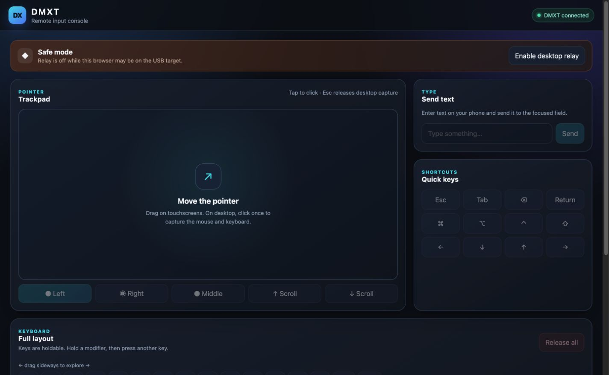
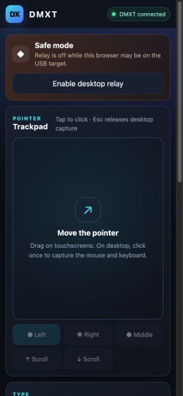

# DMXT

Create a custom USB keyboard and mouse with an Orange Pi Zero 3.

DMXT presents the Orange Pi as a standard USB HID device.

## Web panel

<table>
  <tr>
    <td width="72%"></td>
    <td width="28%"></td>
  </tr>
  <tr>
    <td align="center">Desktop</td>
    <td align="center">Mobile</td>
  </tr>
</table>

## Features

- Direct V4L2-to-Rust HDMI capture with latest-frame-only delivery
- Direct pointer control from the picture over a persistent input channel
- Optional low-latency HDMI sound with compatible capture hardware
- Touchpad with movement, scrolling, and three mouse buttons
- Full holdable keyboard with left/right modifiers, F1–F24, navigation,
  numeric keypad, editing, and volume keys
- Local MCP bridge for AI-assisted viewing and control

## Orange Pi setup

Install `scripts/orangepi-hid-gadget` as
`/usr/local/sbin/orangepi-hid-gadget`, install
`scripts/orangepi-hid.service` under `/etc/systemd/system`, and enable the
service. Install `scripts/opihid` as `/usr/local/bin/opihid` for direct control.

The gadget uses generic Linux USB IDs by default. Override `DMXT_VENDOR_ID`
and `DMXT_PRODUCT_ID` in `/etc/default/dmxt` only with IDs you are authorized
to use.

Install Rust, build `dmxt-fast` with `cargo build --release`, install the binary
under `/usr/local/bin`, and enable `scripts/dmxt-fast.service`. Install
`remote_panel.py` under `/usr/local/lib/orangepi-kvm`. FFmpeg is only needed
when using the Python capture fallback without `dmxt-fast`.
The native service owns capture and interactive HID traffic; Python serves the
panel and keeps the HTTP/MCP compatibility API available.
Adjust the username and path in `scripts/orangepi-remote-panel.service`, then
enable that service. The HDMI capture device defaults to `/dev/video1`; override
`DMXT_VIDEO_DEVICE`, `DMXT_VIDEO_SIZE`, or `DMXT_VIDEO_FPS` in the service when
needed. For audio, install the go2rtc ARM64 binary and the included
`go2rtc.yaml` and `dmxt-media.service`. Keep the panel server bound to loopback
and publish it to your tailnet:

```sh
sudo tailscale serve --bg --set-path /dmxt 8023
sudo tailscale serve --bg --set-path /dmxt-fast 8024
```

Open the Tailscale URL ending in `/dmxt` from a connected device.

## AI control

`dmxt_mcp.py` exposes screen viewing, pointer, keyboard, scrolling, dragging,
and safe input release as a local MCP server. Install `requirements-mcp.txt`,
set `DMXT_URL` if the default URL differs, and run the script over stdio.

## License

MIT
